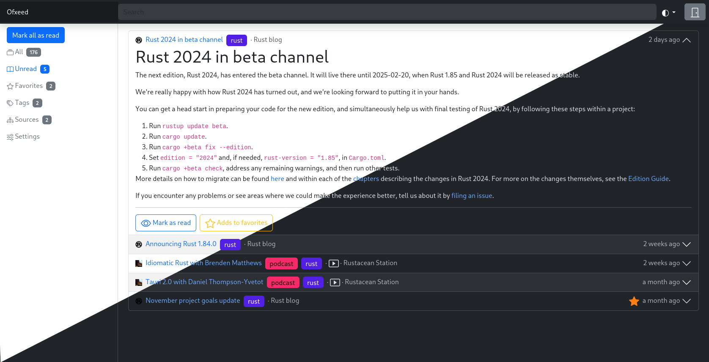

# OxFeed

Feed reader.



## Demo

<https://oxfeed.homecomputing.fr/>

- email: `demo`
- password: `demo`

This is a read-only demo: you can only read/unread and fav/unfav item.

## Compilation

```
make
```

## Installation

Create a new PostgreSQL database:

```
createdb oxfeed
psql -f api/sql/structure.sql oxfeed
```

Here an example of systemd service:

```
[Unit]
Description=oxfeed
After=network.target
After=postgresql.target
Requires=postgresql.service

[Service]
ExecStart=/home/git/public_repositories/oxfeed/current/target/release/oxfeed-api
WorkingDirectory=/home/git/public_repositories/oxfeed/current
Restart=on-failure
RestartSec=10s
Environment="LISTEN_IP=127.0.0.1"
Environment="LISTEN_PORT=8003"
Environment="DATABASE_URL=postgresql://localhost/oxfeed"
Environment="SECRET=change_me"
Environment="RUST_LOG=warn"
Environment="CACHE_DIR=/var/cache/oxfeed"
```
